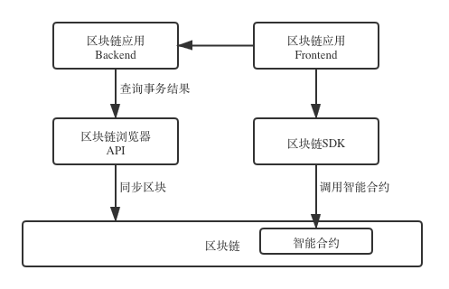

<h1 align="center">区块链应用开发</h1>

DNA为区块链应用开发提供了一站式的解决方案，帮助开发者快速上手区块链应用开发。

区块链应用开发, 相对于一般应用开发, 需要完成另外两个部分工作：智能合约开发和对区块链平台的信息交互。



注解：

* 当区块链应用后端需要从链上同步数据时，可以通过使用DNA提供的 ```SDK```,调用 ```Restful``` 或 ```RPC``` 接口，详细接口请参考相关接口文档。
  * [Restful](cli/06-restful-specification.md) 
  * [RPC](cli/05-rpc-specification.md)
> 另外, 区块链应用后端不是必须的，有些轻量级区块链应用可以完全基于区块链智能合约和区块链平台实现。

* 大部分区块链应用有往链上存取数据的需求，相关的设计可以参考 [链上数据存取](07-deposit-certificate.md)


一般情况下, 区块链应用的核心逻辑是在智能合约中完成。
DNA提供的多个工具，能够帮助开发者快速开发和部署智能合约。
DNA还为区块链应用开发提供了与合约交互的接口规范 ```dAPI```。
通过```dAPI```，用户可以安全方便地使用区块链应用；区块链应用开发者也只需要专注于区块链应用的业务逻辑开发。

## 智能合约开发

本教程将从四个部分来指导使用，分别为智能合约创建、部署、测试以及最终部署到DNA生产网络。

首先，需要以下工具：

- [SmartX](https://smartx.dnaproject.org/) —— DNA的在线智能合约集成开发环境和调试器。

> 您可以直接在 SmartX 上基于DNA测试网完成合约的部署和测试。

关于智能合约的开发，请参考我们的 [相关教程](smartcontract/01-started.md)。

#### 创建你的智能合约


#### 编译你的智能合约


一旦你对你的智能合约确认并认可，就可以使用 ```SmartX``` 将其部署到DNA测试网络。

在 ```SmartX``` 中选择部署，然后在信息字段（名称、作者等）中输入相应的详细信息。完成此操作后，选择 `deploy`。


<p>
<p><br>

####  在 SmartX 调用智能合约

你可以在 `Run` 状态下，选择任何适用的方法来调用在 SmartX 中完成的智能合约。下面我们使用 `Arith` 模板来进行实例的演示，选择使用`add` 方法将两个数字相加。


点击 `Run` 后，```SmartX```将智能合约调用请求发送到DNA测试区块链上， 最终调用的结果将显示在 SmartX 的日志窗口中以供查阅。


<p><br>

#### 检查调用智能合约

你可以使用DNA测试网区块浏览器中查找对应的`Transaction`和`Block`， 

单击 `Detail` 链接能够获得更多详细信息。


<p><br>

#### 部署到主网

完成上述步骤后，你可能希望将智能合约部署到DNA主网。
要执行此操作，请在 ```SmartX``` 中选择右上角的 ⚙ 图标，切换到主网并保存。
最后，返回 ```SmartX``` 并按照与**在 SmartX 中部署智能合约**一节中所述步骤进行部署。
现在，你的智能合约已经被部署到了DNA主网，你可以像**在 SmartX 中调用智能合约**一节中所述步骤进行调用。
